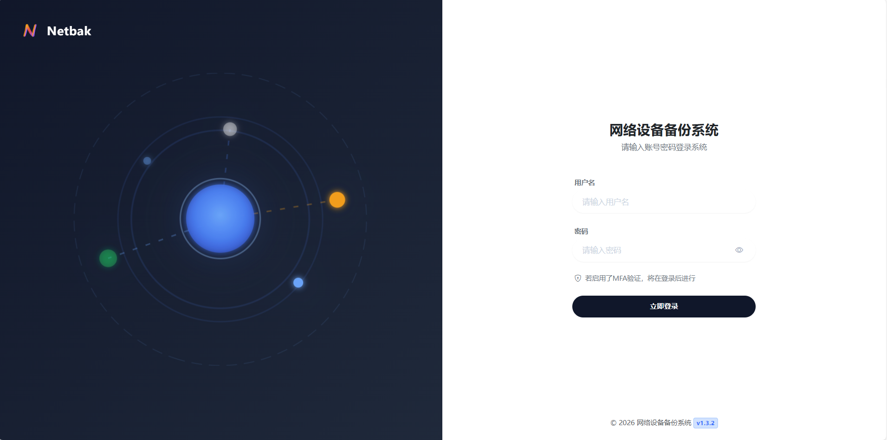
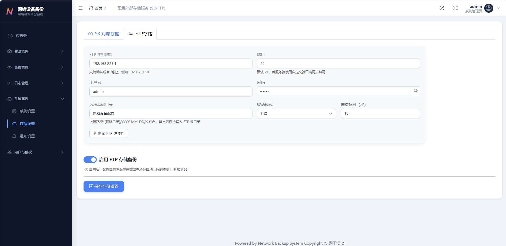
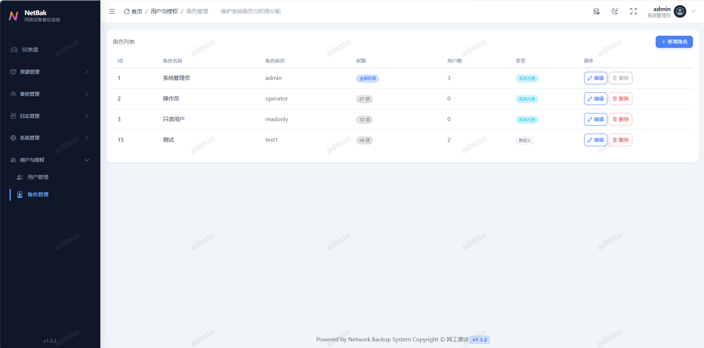

# Netbak (网络设备备份系统)

这是一个基于 Python 和 FastAPI 构建的现代化网络设备配置备份与管理平台，集成设备资产管理、自动化备份、配置差异分析、WebShell 运维入口、RBAC 权限控制与审计日志，为网络管理员提供完整的配置生命周期管理能力。

> ⚠️ **安全建议**: 
> - 为了保障网络设备安全，建议使用 **只读权限 (Read-Only)** 账号进行设备备份，最小化安全风险。
> - 建议先在测试环境测试功能，在应用到生产环境，避免直接在生产环境中使用。

## 💬 交流与反馈

- **Gitee Issues**：适合具体的技术问题。提问时请提供完整信息（截图、日志等），有助于快速定位。
- **公众号交流**：建议优先在相关文章下的留言区交流。若需私信后台提问，先点赞/推荐文章是最好的"敲门砖"，我在后台也能感受到这份心意。

  

> ---
> ### ⚠️ 开源沟通提醒（请先阅读）
> 本项目为 **开源分享**，并非商业服务。
>
> 请勿将作者视为客服，保持 **友好、尊重、信息完整** 的方式，沟通效率会更高。
> ---

## ✨ 主要功能


- **设备与资源管理**:
  - 设备、分组、凭据、备份命令模板统一管理，支持 Excel/CSV 批量导入导出。
  - **连通性检测**: 基于 Celery 的批量异步巡检与可用性统计。
  - **WebShell**: 在浏览器内安全访问设备终端，便于运维排障。

- **自动化备份与调度**:
  - 基于 Netmiko 的多厂商支持（Cisco, Huawei, H3C, Juniper 等）。
  - 支持手动触发与 Crontab 定时任务，内置 APScheduler 与 Celery 异步执行。
  - 失败自动重试、任务超时控制与备份留存清理策略。

- **配置管理与对比**:
  - **版本对比**: 内置 Diff 查看器，支持并排与统一视图。
  - **Diff 忽略规则**: 可配置正则表达式忽略无关行。
  - **配置搜索**: 在历史备份中快速检索关键字。

- **可视化仪表盘**: 
  - 实时展示系统状态、备份成功率、最近失败任务。
  - 备份趋势与设备平台分布概览。

- **安全与权限 (RBAC)**: 
  - 角色与权限分级管理，支持用户与角色可视化配置。
  - MFA 双因素认证与管理员恢复码。
  - **凭据加密**: 敏感凭据（密码/Secret）在数据库中加密存储。

- **审计与日志**: 
  - **操作审计**: 详尽记录用户对系统的所有增删改操作。
  - **登录日志**: 记录用户登录成功、失败及登出行为，支持异常登录分析。

- **通知与存储**: 
  - **存储归档**: 支持将备份文件自动同步至 AWS S3 或兼容的对象存储（MinIO, Aliyun OSS 等），以及远端FTP存储。
  - **邮件通知**: 支持备份失败、配置变更与汇总告警邮件发送与测试。


## 🛠 技术栈

- **后端**: Python 3.10+, FastAPI, SQLModel (SQLAlchemy), Celery, APScheduler, Redis.
- **前端**: Bootstrap 5, Jinja2 模板引擎, ECharts.
- **网络与自动化**: Netmiko, AsyncSSH, Telnetlib3.
- **数据库**: PostgreSQL（生产推荐）/ SQLite（开发可选）
- **容器化**: Docker, Docker Compose.

## 🚀 快速开始

### 方式一：Docker Compose 部署 (推荐)

最简单快捷的部署方式，适合生产环境或快速体验。

1.  **克隆仓库**:
    ```bash
    git clone https://gitee.com/xmp111/network_backup.git
    cd network_backup
    ```

2.  **配置环境变量**:
    复制docker compose 环境示例配置：
    ```bash
    cp .env.docker.example .env
    ```
    *修改 `.env` 中的 `SECRET_KEY`、`数据库密码`、`redis密码`及其他敏感信息。*

3.  **启动服务**:
    ```bash
    docker-compose up -d
    ```

4.  **访问系统**:
    打开浏览器访问 `http://localhost:8000`。
    
    **默认管理员账号**:
    - 用户名: `admin`
    - 密码: `admin`
    *(请首次登录后立即修改密码)*

#### 🔄 版本升级

当需要更新系统到最新版本时，请在项目根目录下执行：

```bash
# 进入项目目录
cd network_backup

# 拉取最新代码
git pull origin master

# 重新构建并重启服务
docker-compose up -d --build
```

### 方式二：本地开发环境搭建

适合开发调试或非容器化环境。

#### 前置要求
- Python 3.10+
- Redis Server (需自行安装，必须运行，用于异步任务队列)
- PostgreSQL (自行安装，可选，开发环境可使用 SQLite)

#### 搭建步骤

1.  **安装依赖**:
    ```bash
    pip install -r requirements.txt
    ```

2.  **配置环境变量**:
    复制开发环境示例配置：
    ```bash
    cp .env.example .env
    ```
    **修改 `.env` 文件**:
    - **数据库**: 默认推荐使用 SQLite 方便开发（生产环境建议使用PostgreSQL）。找到 `DATABASE_URL` 配置行，取消注释：
      ```properties
      DATABASE_URL=sqlite:///./dev.db
      ```
    - **Redis**: 确保 Redis 服务已启动，并根据需要调整 `REDIS_HOST` 等配置。

3.  **初始化数据库**:
    ```bash
    alembic upgrade head
    ```

4.  **创建初始管理员用户**:
    *(系统启动时会自动检查，若无用户则无需手动创建，默认 admin/admin)*

5.  **启动 Celery Worker (处理后台任务)**:
    设置 Celery worker 在后台持续运行，例如：centos通过 systemd 将 Celery 配置为系统守护进程（服务），实现后台运行、开机自启和自动崩溃重启。
    
    **Windows**:
    ```bash
    celery -A app.celery_app.celery_app worker --loglevel=info -P eventlet -c 50
    ```
    
    **Linux / macOS**:
    ```bash
    celery -A app.celery_app.celery_app worker --loglevel=info -c 50
    ```

6.  **启动 Web 服务**:
    ```bash
    uvicorn app.main:app --reload
    ```

7.  **访问系统**:
    打开浏览器访问 `http://localhost:8000`。

#### 🔄 版本升级

本地部署环境更新时，请根据您的安装方式更新代码，并执行后续步骤：

1.  **更新代码**:

    - **Git 用户 (推荐)**:
      在项目根目录执行：
      ```bash
      git pull origin master
      ```

    - **ZIP 下载用户**:
      1. 备份旧目录重要文件
      2. 下载最新的源码压缩包并解压。将新代码替换旧目录。
      3. **⚠️ 注意**: 请务必 **跳过 (不要覆盖)** `.env` 配置文件和 `dev.db` (如果使用 SQLite) 数据库文件，以免丢失配置和数据。

2.  **更新依赖**:
    ```bash
    pip install -r requirements.txt
    ```

3.  **应用数据库变更**:
    ```bash
    alembic upgrade head
    ```

4.  **重启服务**:
    请手动停止并重新启动 Celery Worker 和 Web 服务 (Uvicorn)。

## ⚙️ 关键配置

主要通过环境变量进行配置 (可在 `.env.prod` 或 `docker-compose.yml` 中设置):

- **基础配置**:
  - `APP_NAME`: 系统显示的名称.
  - `SECRET_KEY`: 用于加密 Session 和敏感数据的密钥 (务必修改).
  - `TIMEZONE_OFFSET`: 时区偏移量 (默认为 "+08:00").
  - `ENABLE_SCHEDULER`: 是否启用内置调度器 (多实例部署时仅保留一个实例开启).
  - `BOOTSTRAP_ADMIN_USERNAME` / `BOOTSTRAP_ADMIN_PASSWORD`: 初始化管理员账号密码.

- **数据库与中间件**:
  - `DATABASE_URL`: 数据库连接字符串.
  - `CELERY_BROKER_URL`: Redis 连接地址.
  - `CELERY_RESULT_BACKEND`: Celery 结果存储地址 (可选).
  - `REDIS_HOST` / `REDIS_PASSWORD`: Redis 连接参数.


## 📚 界面展示
### 登录界面 (Login)


### 仪表盘 (Dashboard)


### 设备管理 (Device Management)


### 备份与任务 (Backups & Tasks)


### 凭据管理 (Credentials)


### 审计与日志 (Logs)


### 系统管理 (System Management)

### 通知设置 (Notifications)

### 存储设置 (Storage Settings)


### 用户和权限 (User Management)




## 📄 许可与使用声明

为明确本项目授权边界与使用规则，现作如下声明：

1. 定义与适用范围  
   1.1 “本项目”系指本仓库公开发布的全部源码、脚本、配置、文档及其后续版本。  
   1.2 “使用者”系指下载、复制、修改、部署、分发或以其他方式使用本项目的任何自然人、法人或非法人组织。  
   1.3 本声明适用于本项目的原始版本及其二次开发版本。  

2. 开源许可与优先适用  
   2.1 本项目基于 Apache License 2.0（以下简称“Apache-2.0”）发布。  
   2.2 使用者应完整、持续地履行 Apache-2.0 规定的全部义务。  
   2.3 如本声明与 Apache-2.0 的强制性条款存在不一致之处，以 Apache-2.0 为准。  

3. 署名与声明保留义务  
   3.1 使用者在任何形式的再发布、部署交付、商业使用或二次开发中，应保留作者技术支持声明、源码头部版权声明、作者署名及项目出处。  
   3.2 前述信息不得删除、隐匿、替换、淡化或以其他方式导致识别性下降。  

4. 商业使用与限制  
   4.1 本项目允许依法用于商业目的。  
   4.2 未经原作者书面许可，不支持将本项目或其二次开发版本以“二次开源并收费”的模式对外发布。  
   4.3 未经原作者书面许可，不支持基于本项目二次开发版本申请软件著作权、专利权或其他排他性商业权益主张。  

5. 竞品与二次开发场景  
   5.1 使用者将本项目二次开发后用于商业交付或作为开源竞品发布时，仍应严格履行本声明第3条约定的署名与声明保留义务。  
   5.2 任何规避、拆分、转译或包装行为，不影响本条款的约束效力。  

6. 违约责任与权利保留  
   6.1 使用者违反本声明或 Apache-2.0 相关义务的，原作者有权要求立即停止侵害、限期整改并保留依法追究责任的权利。  
   6.2 本声明未尽事宜，依适用法律法规及 Apache-2.0 执行。  

7. 免责声明与风险提示  
   7.1 按“原样”提供：本项目及其关联代码、文档均按“原样”提供，不带有任何明示或暗示的担保（包括但不限于对适销性、特定用途的适用性或非侵权性的担保）。  
   7.2 风险自担：鉴于本项目涉及网络设备的核心配置备份、WebShell 终端管理等高危操作，任何不当配置、系统漏洞、网络波动或第三方依赖缺陷均可能导致设备断网、配置丢失、业务中断或敏感数据泄露。使用者在部署和使用本项目时需自行评估并承担全部风险。  
   7.3 责任豁免：在任何情况下（无论是否因合同违约、侵权行为或其他原因），本项目的原作者、贡献者及版权持有人均不对因使用、无法使用本项目或与本项目相关的其他行为而产生的任何直接、间接、特殊、偶然或惩罚性损害（包括但不限于利润损失、业务中断、数据丢失或系统崩溃）承担任何法律责任。  
   7.4 安全与合规责任：使用者应自行负责妥善保管设备凭据、加密密钥（如 `SECRET_KEY`）及系统访问权限。使用者需确保本系统的部署与使用符合所在国家/地区的相关法律法规及所在组织的安全合规与审计要求。严禁将本项目用于未经授权的网络渗透、非法控制或破坏活动。  
   7.5 生产环境建议：强烈建议在将本项目正式接入生产网络前，于隔离的测试环境进行充分的测试与评估。在进行网络配置备份时，强烈建议遵循“最小权限原则”，为系统分配仅具只读（Read-Only）权限的设备账号。
