# Netbak (网络设备备份系统)

这是一个基于 Python 和 FastAPI 构建的现代化网络设备配置备份与管理平台，集成设备资产管理、自动化备份、配置差异分析、WebShell 运维入口、RBAC 权限控制与审计日志，为网络管理员提供完整的配置生命周期管理能力。

## ✨ 主要功能

> ⚠️ **安全建议**: 为了保障网络设备安全，建议使用 **只读权限 (Read-Only)** 账号进行设备备份，最小化安全风险。

- **设备与资源管理**:
  - 设备、分组、凭据、备份命令模板统一管理，支持 Excel/CSV 批量导入导出。
  - **连通性检测**: 基于 Celery 的批量异步巡检与可用性统计。
  - **WebShell**: 在浏览器内安全访问设备终端，便于运维排障。

- **自动化备份与调度**:
  - 基于 Netmiko 的多厂商支持（Cisco, Huawei, H3C, Juniper 等）。
  - 支持手动触发与 Crontab 定时任务，内置 APScheduler 与 Celery 异步执行。
  - 失败自动重试、任务超时控制与备份留存清理策略。

- **配置管理与对比**:
  - **版本对比**: 内置 Diff 查看器，支持并排与统一视图。
  - **Diff 忽略规则**: 可配置正则表达式忽略无关行。
  - **配置搜索**: 在历史备份中快速检索关键字。

- **可视化仪表盘**: 
  - 实时展示系统状态、备份成功率、最近失败任务。
  - 备份趋势与设备平台分布概览。

- **安全与权限 (RBAC)**: 
  - 角色与权限分级管理，支持用户与角色可视化配置。
  - MFA 双因素认证与管理员恢复码。
  - **凭据加密**: 敏感凭据（密码/Secret）在数据库中加密存储。

- **审计与日志**: 
  - **操作审计**: 详尽记录用户对系统的所有增删改操作。
  - **登录日志**: 记录用户登录成功、失败及登出行为，支持异常登录分析。

- **通知与存储**: 
  - **S3 归档**: 支持将备份文件自动同步至 AWS S3 或兼容的对象存储（MinIO, Aliyun OSS 等）。
  - **邮件通知**: 支持备份失败、配置变更与汇总告警邮件发送与测试。


## 🛠 技术栈

- **后端**: Python 3.10+, FastAPI, SQLModel (SQLAlchemy), Celery, APScheduler, Redis.
- **前端**: Bootstrap 5, Jinja2 模板引擎, ECharts.
- **网络与自动化**: Netmiko, AsyncSSH, Telnetlib3.
- **数据库**: PostgreSQL（生产推荐）/ SQLite（开发可选）
- **容器化**: Docker, Docker Compose.

## 🚀 快速开始

### 方式一：Docker Compose 部署 (推荐)

最简单快捷的部署方式，适合生产环境或快速体验。

1.  **克隆仓库**:
    ```bash
    git clone https://gitee.com/xmp111/network_backup.git
    cd network_backup
    ```

2.  **配置环境变量**:
    复制docker compose 环境示例配置：
    ```bash
    cp .env.docker.example .env
    ```
    *修改 `.env` 中的 `SECRET_KEY`、`数据库密码`、`redis密码`及其他敏感信息。*

3.  **启动服务**:
    ```bash
    docker-compose up -d
    ```

4.  **访问系统**:
    打开浏览器访问 `http://localhost:8000`。
    
    **默认管理员账号**:
    - 用户名: `admin`
    - 密码: `admin`
    *(请首次登录后立即修改密码)*

#### 🔄 版本升级

当需要更新系统到最新版本时，请在项目根目录下执行：

```bash
# 进入项目目录
cd network_backup

# 拉取最新代码
git pull origin master

# 重新构建并重启服务
docker-compose up -d --build
```

### 方式二：本地开发环境搭建

适合开发调试或非容器化环境。

#### 前置要求
- Python 3.10+
- Redis Server (需自行安装，必须运行，用于异步任务队列)
- PostgreSQL (自行安装，可选，开发环境可使用 SQLite)

#### 搭建步骤

1.  **安装依赖**:
    ```bash
    pip install -r requirements.txt
    ```

2.  **配置环境变量**:
    复制开发环境示例配置：
    ```bash
    cp .env.example .env
    ```
    **修改 `.env` 文件**:
    - **数据库**: 默认推荐使用 SQLite 方便开发。找到 `DATABASE_URL` 配置行，取消注释：
      ```properties
      DATABASE_URL=sqlite:///./dev.db
      ```
    - **Redis**: 确保 Redis 服务已启动，并根据需要调整 `REDIS_HOST` 等配置。

3.  **初始化数据库**:
    ```bash
    alembic upgrade head
    ```

4.  **创建初始管理员用户**:
    *(系统启动时会自动检查，若无用户则无需手动创建，默认 admin/admin)*

5.  **启动 Celery Worker (处理后台任务)**:
    设置 Celery worker 在后台持续运行，例如：centos通过 systemd 将 Celery 配置为系统守护进程（服务），实现后台运行、开机自启和自动崩溃重启。
    
    **Windows**:
    ```bash
    celery -A app.celery_app.celery_app worker --loglevel=info -P eventlet -c 50
    ```
    
    **Linux / macOS**:
    ```bash
    celery -A app.celery_app.celery_app worker --loglevel=info -c 50
    ```

6.  **启动 Web 服务**:
    ```bash
    uvicorn app.main:app --reload
    ```

7.  **访问系统**:
    打开浏览器访问 `http://localhost:8000`。

## ⚙️ 关键配置

主要通过环境变量进行配置 (可在 `.env.prod` 或 `docker-compose.yml` 中设置):

- **基础配置**:
  - `APP_NAME`: 系统显示的名称.
  - `SECRET_KEY`: 用于加密 Session 和敏感数据的密钥 (务必修改).
  - `TIMEZONE_OFFSET`: 时区偏移量 (默认为 "+08:00").
  - `ENABLE_SCHEDULER`: 是否启用内置调度器 (多实例部署时仅保留一个实例开启).
  - `BOOTSTRAP_ADMIN_USERNAME` / `BOOTSTRAP_ADMIN_PASSWORD`: 初始化管理员账号密码.

- **数据库与中间件**:
  - `DATABASE_URL`: 数据库连接字符串.
  - `CELERY_BROKER_URL`: Redis 连接地址.
  - `CELERY_RESULT_BACKEND`: Celery 结果存储地址 (可选).
  - `REDIS_HOST` / `REDIS_PASSWORD`: Redis 连接参数.


## 📚 界面展示

### 仪表盘 (Dashboard)
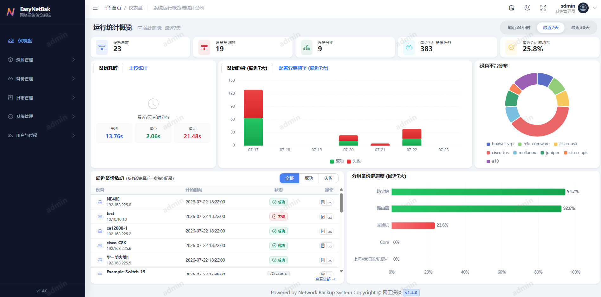

### 设备管理 (Device Management)
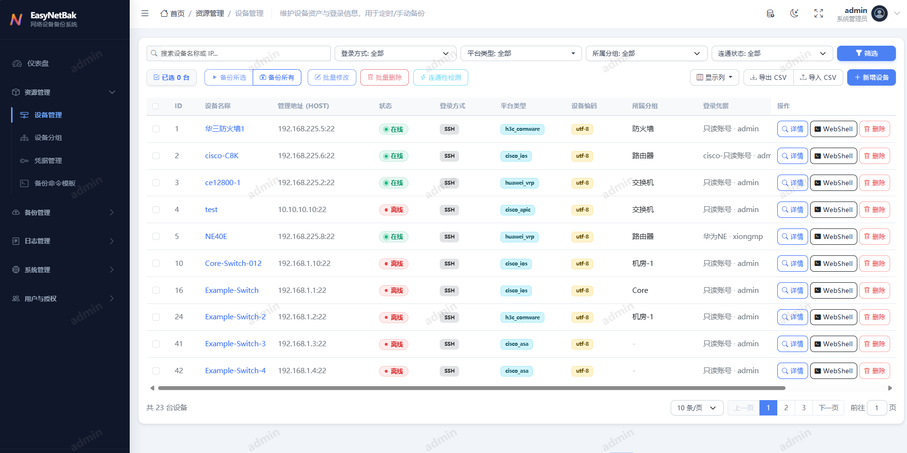

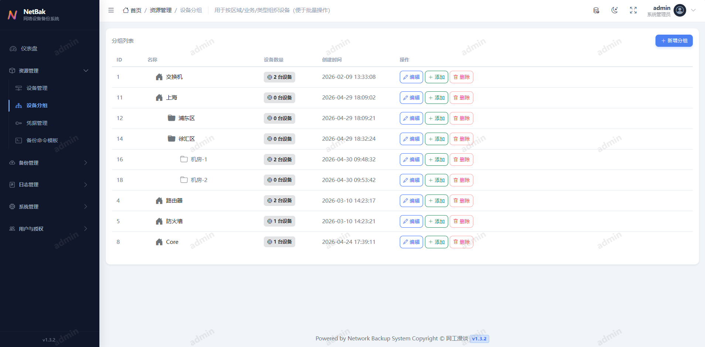

### 备份与任务 (Backups & Tasks)
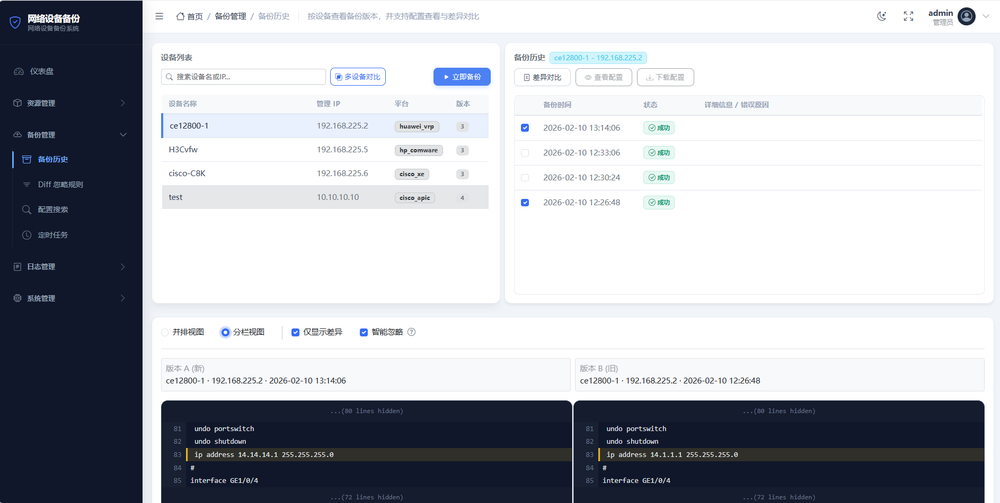

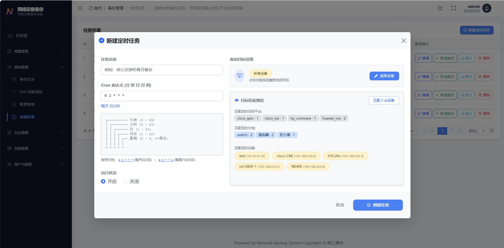

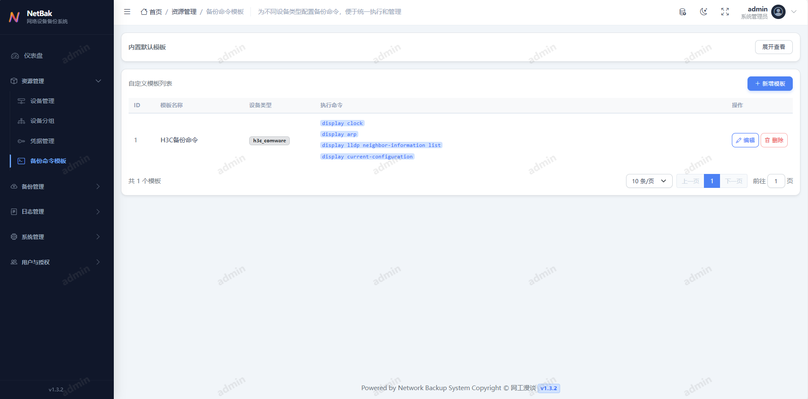

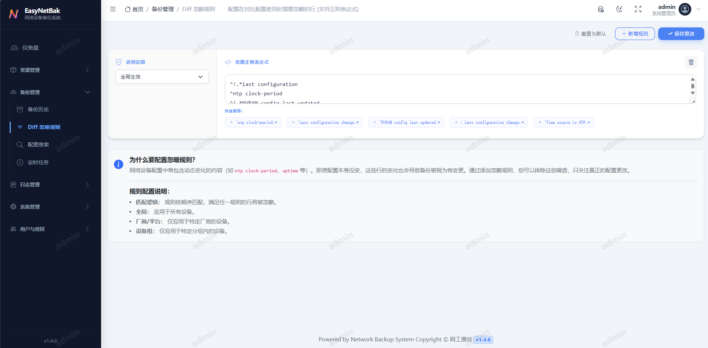

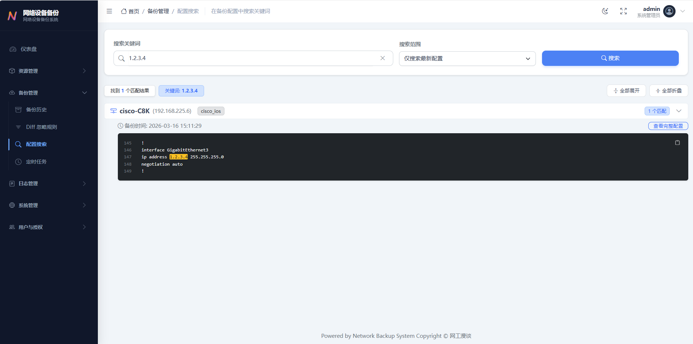

### 凭据管理 (Credentials)
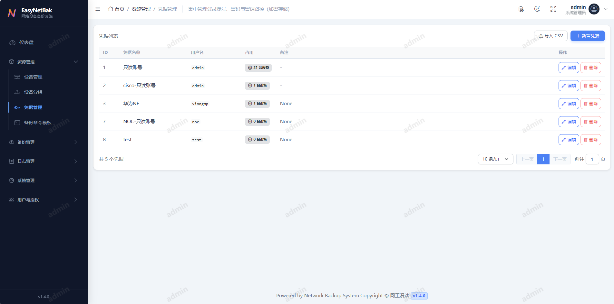

### 审计与日志 (Logs)
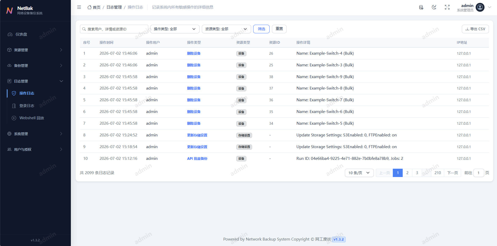

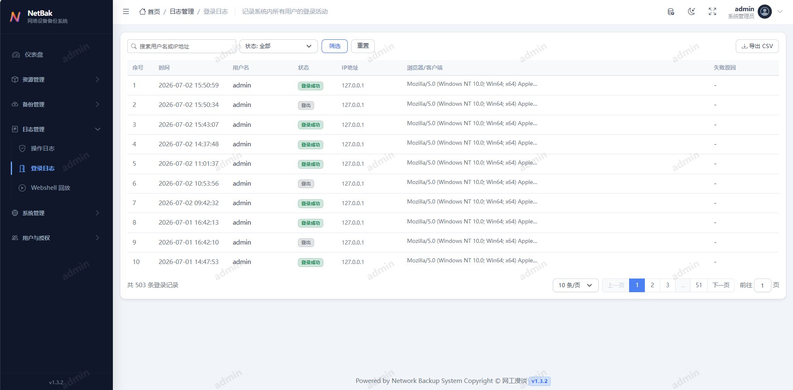

### 系统管理 (System Management)
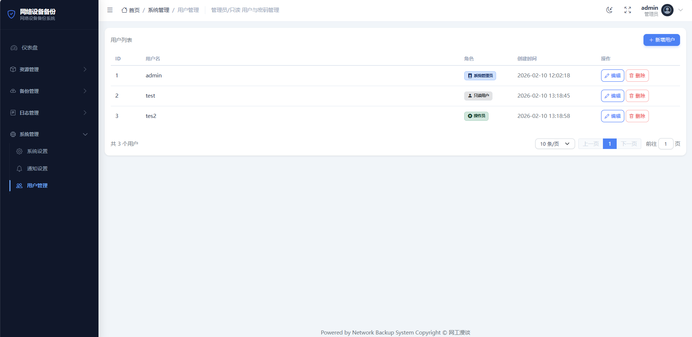

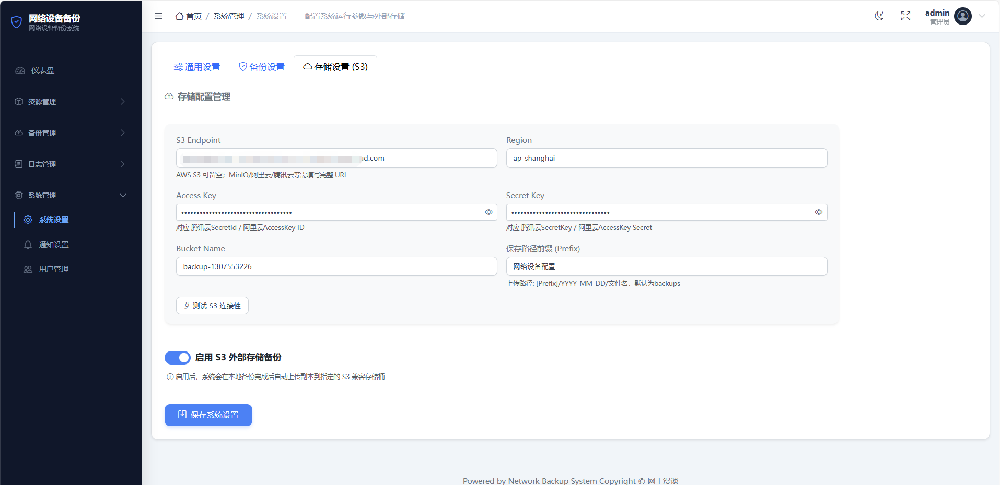

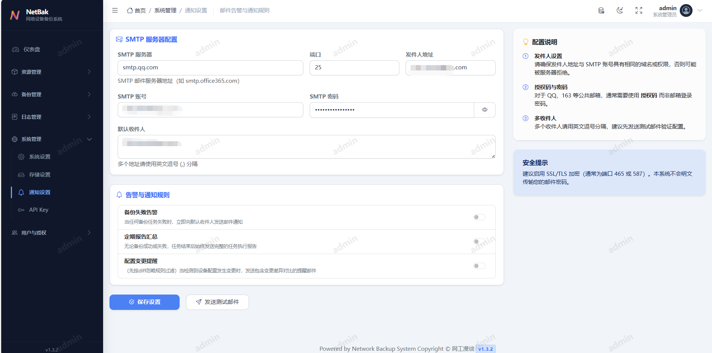

## 🤝 贡献

欢迎提交 Issue 和 Pull Request 来改进本项目。

