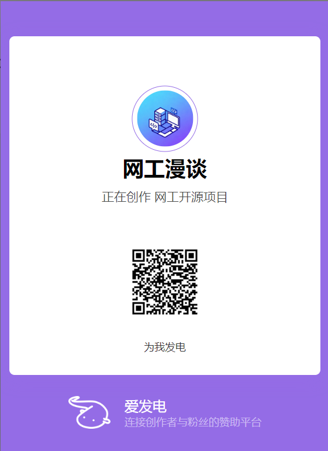
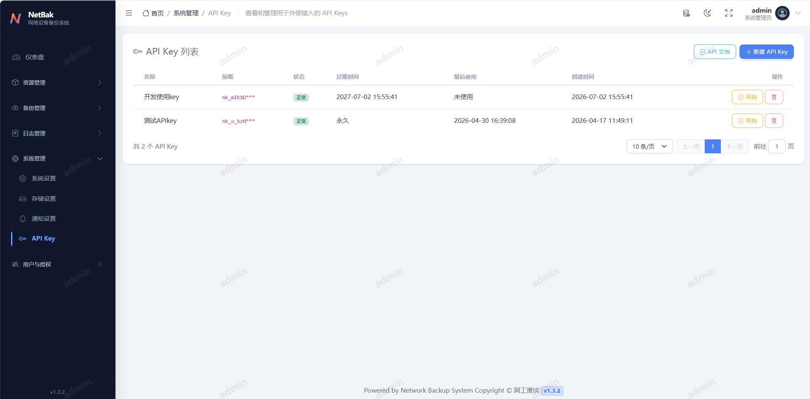

# EasyNetBak (网络设备备份系统)

这是一个基于 Python 和 FastAPI 构建的现代化网络设备配置备份与管理平台，集成设备资产管理、自动化备份、配置差异分析、WebShell 运维入口、RBAC 权限控制与审计日志，为网络管理员提供完整的配置生命周期管理能力。

> ⚠️ **安全建议**:
>
> - 为了保障网络设备安全，建议使用 **只读权限 (Read-Only)** 账号进行设备备份，最小化安全风险。
> - 建议先在测试环境测试功能，再应用到生产环境，避免直接在生产环境中使用。

## 💬 交流、支持与反馈

- **Gitee Issues**：适合提交可复现的问题、功能建议和设备兼容性反馈。提问时请提供版本、部署方式、操作步骤及脱敏后的日志，以便快速定位。
- **公众号交流**：建议优先在相关文章下的留言区交流，也可以通过公众号后台联系。

  

请勿在公开渠道提交设备密码、Token、私钥、完整配置、内网地址或其他敏感信息。

EasyNetBak 是由社区驱动的开源项目，社区支持不承诺固定响应时间或服务等级。企业私有化部署、设备适配、技术支持及商业合作需求，可通过项目公布的联系方式单独沟通。

***

## 💖 支持项目

如果这个项目对你有帮助，欢迎通过以下方式支持：

### ⭐ Star 项目

点击右上角的 ⭐ Star 按钮，让更多人发现这个项目。

### 💰 赞赏支持

- 💖[爱发电](https://ifdian.net/a/midwinter) —— 点击这里访问我的爱发电主页或扫描下方二维码，请我喝杯咖啡，持续支持项目发展
  

***

## ✨ 主要功能

| 模块               | 核心功能                                                                                                                        |
| :--------------- | :-------------------------------------------------------------------------------------------------------------------------- |
| **设备与资源管理**      | • 统一管理设备、分组、凭据及备份命令模板 (支持 CSV 批量导入导出)<br>• **连通性检测**: 基于 Celery 的批量异步巡检与可用性统计<br>• **WebShell**: 浏览器内安全访问设备终端，便于运维排障          |
| **自动化备份与调度**     | • 基于 Netmiko 的多厂商支持 (Cisco, Huawei, H3C, Juniper 等)<br>• 支持手动触发与 Crontab 定时任务 (内置 APScheduler 与 Celery)<br>• 具备失败重试、任务超时控制与备份留存清理策略 |
| **配置管理与对比**      | • **版本对比**: 内置 Diff 查看器，支持并排与统一视图<br>• **Diff 忽略规则**: 可配置正则表达式忽略无关行<br>• **配置搜索**: 在历史备份中快速检索关键字                                    |
| **可视化仪表盘**       | • 实时展示系统状态、备份成功率、最近失败任务<br>• 提供备份趋势与设备平台分布概览                                                                                    |
| **安全与权限 (RBAC)** | • 角色与权限分级管理，支持可视化配置<br>• 支持 MFA 双因素认证与管理员恢复码<br>• **凭据加密**: 敏感凭据在数据库中加密存储                                                           |
| **审计与日志**        | • **操作审计**: 详尽记录用户对系统的所有增删改操作<br>• **登录日志**: 记录用户登录、失败及登出行为，支持异常分析                                                              |
| **通知与存储**        | • **存储归档**: 自动同步至 AWS S3、兼容对象存储 (MinIO/OSS) 或远端 FTP<br>• **邮件通知**: 支持备份失败、配置变更与汇总告警邮件发送与测试                                      |

## 🛠 技术栈

| 领域         | 技术选型                                                                     |
| :--------- | :----------------------------------------------------------------------- |
| **后端**     | Python 3.10+ (Docker 镜像默认使用 Python 3.12), FastAPI, SQLModel (SQLAlchemy), Celery, APScheduler, Redis |
| **前端**     | Bootstrap 5, Jinja2 模板引擎, ECharts                                        |
| **网络与自动化** | Netmiko, AsyncSSH, Telnetlib3                                            |
| **数据库**    | PostgreSQL (生产推荐) / SQLite (开发可选)                                        |
| **容器化**    | Docker, Docker Compose                                                   |

## 🚀 快速开始

### 方式一：Docker Compose 部署 (推荐)

最简单快捷的部署方式，适合生产环境或快速体验。

1. **克隆仓库**:
   ```bash
   git clone https://gitee.com/xmp111/network_backup.git
   cd network_backup
   ```
2. **配置环境变量**:
   复制docker compose 环境示例配置：
   ```bash
   cp .env.docker.example .env
   ```
   *修改* *`.env`* *中的* *`SECRET_KEY`、`数据库密码`、`redis密码`及其他敏感信息。*
3. **启动服务**:
   ```bash
   docker compose up -d
   ```
4. **访问系统**:
   打开浏览器访问 `http://localhost:8000`。

   **默认管理员账号**:
   - 用户名: `admin`
   - 密码: `admin`
     *(首次登录后系统会要求立即修改密码)*

#### 🔄 版本升级

当需要更新系统到最新版本时，请在项目根目录下执行：

```bash
# 进入项目目录
cd network_backup

# 拉取最新代码
git pull origin master

# 重新构建并重启服务
docker compose up -d --build
```

### 方式二：本地开发环境搭建

适合开发调试或非容器化环境。

#### 前置要求

- Python 3.10+
- Redis Server (需自行安装，必须运行，用于异步任务队列)
- PostgreSQL (自行安装，可选，开发环境可使用 SQLite)

#### 搭建步骤

1. **安装依赖**:
   ```bash
   pip install -r requirements.txt
   ```
2. **配置环境变量**:
   复制开发环境示例配置：
   ```bash
   cp .env.example .env
   ```
   **修改** **`.env`** **文件**:
   - **数据库**: 默认推荐使用 SQLite 方便开发（生产环境建议使用 PostgreSQL）。找到 `DATABASE_URL` 配置行，取消注释：
     ```properties
     DATABASE_URL=sqlite:///./dev.db
     ```
   - **Redis**: 确保 Redis 服务已启动，并根据需要调整 `REDIS_HOST` 等配置。
3. **初始化数据库**:
   ```bash
   alembic upgrade head
   ```
4. **创建初始管理员用户**:
   *(系统启动时会自动检查，若无用户则无需手动创建，默认 admin/admin)*
5. **启动 Celery Worker (处理后台任务)**:
   设置 Celery worker 在后台持续运行，例如：CentOS 通过 systemd 将 Celery 配置为系统守护进程（服务），实现后台运行、开机自启和自动崩溃重启。

   **Windows**:
   ```bash
   celery -A app.celery_app.celery_app worker --loglevel=info -P eventlet -c 50
   ```
   **Linux / macOS**:
   ```bash
   celery -A app.celery_app.celery_app worker --loglevel=info -c 50
   ```
6. **启动 Web 服务**:
   ```bash
   uvicorn app.main:app --reload
   ```
7. **访问系统**:
   打开浏览器访问 `http://localhost:8000`。

#### 🔄 版本升级

本地部署环境更新时，请根据您的安装方式更新代码，并执行后续步骤：

1. **更新代码**:
   - **Git 用户 (推荐)**:
     在项目根目录执行：
     ```bash
     git pull origin master
     ```
   - **ZIP 下载用户**:
     1. 备份旧目录重要文件
     2. 下载最新的源码压缩包并解压。将新代码替换旧目录。
     3. **⚠️ 注意**: 请务必 **跳过 (不要覆盖)** `.env` 配置文件和 `dev.db` (如果使用 SQLite) 数据库文件，以免丢失配置和数据。
2. **更新依赖**:
   ```bash
   pip install -r requirements.txt
   ```
3. **应用数据库变更**:
   ```bash
   alembic upgrade head
   ```
4. **重启服务**:
   请手动停止并重新启动 Celery Worker 和 Web 服务 (Uvicorn)。

## ⚙️ 关键配置

主要通过环境变量进行配置 (可在 `.env` 或 `docker-compose.yml` 中设置):

- **基础配置**:
  - `SECRET_KEY`: 用于加密 Session 和敏感数据的密钥 (务必修改).
  - `TIMEZONE_OFFSET`: 时区偏移量 (默认为 "+08:00").
  - `ENABLE_SCHEDULER`: 是否启用内置调度器 (多实例部署时仅保留一个实例开启).
  - `BOOTSTRAP_ADMIN_USERNAME` / `BOOTSTRAP_ADMIN_PASSWORD`: 初始化管理员账号密码.
- **数据库与中间件**:
  - `DATABASE_URL`: 数据库连接字符串.
  - `CELERY_BROKER_URL`: Redis 连接地址.
  - `CELERY_RESULT_BACKEND`: Celery 结果存储地址 (可选).
  - `REDIS_HOST` / `REDIS_PASSWORD`: Redis 连接参数.

## 📚 界面展示

### 登录界面 (Login)


### 仪表盘 (Dashboard)


### 设备管理 (Device Management)


### 备份与任务 (Backups & Tasks)


### 审计与日志 (Logs)


### 系统管理 (System Management)


### 通知设置 (Notifications)


### 存储设置 (Storage Settings)


### 用户和权限 (User Management)


### API接口和文档




## 📄 开源许可

EasyNetBak 基于 [Apache License 2.0](LICENSE) 开源发布。

在遵守 Apache-2.0 条款的前提下，任何个人或组织均可使用、复制、修改和分发本项目，包括将其用于商业用途。

再分发本项目或其衍生版本时，请按照 Apache-2.0 的要求：

- 向接收者提供一份 Apache-2.0 许可证；
- 在修改过的文件中保留明确的修改说明；
- 保留适用的版权、专利、商标和署名声明；
- 按照 Apache-2.0 第 4 条的要求保留本项目 `NOTICE` 文件中的适用内容。

本 README 仅用于介绍项目、说明安全风险和提供使用建议，不增加或修改 Apache-2.0 规定的授权条件。如本 README 与 `LICENSE` 的内容存在不一致，以 `LICENSE` 为准。

### 名称与标识

Apache-2.0 不授予 EasyNetBak 名称、Logo 或其他项目标识的商标使用权。

在说明软件来源、引用项目名称以及按 `NOTICE` 要求进行合理署名时，可以合理使用 EasyNetBak 名称；未经授权，不得使用 EasyNetBak 名称或标识暗示其产品、服务或衍生版本获得本项目官方认证、授权或背书。

## ⚠️ 安全与责任提示

本项目按照 Apache-2.0 以“原样”提供，不提供任何明示或暗示的担保。许可证中的免责声明与责任限制以 `LICENSE` 为准。

EasyNetBak 涉及网络设备凭据、配置备份、WebShell、异步任务和远程存储。部署和使用前，请自行评估网络安全、数据保护和业务连续性风险，并特别注意：

- 优先使用仅具只读权限的设备账号；
- 不要将 `.env`、设备密码、Token、私钥或完整配置内容提交到代码仓库；
- 在隔离的测试环境完成验证后再接入生产网络；
- 妥善保管 `SECRET_KEY`、数据库和备份数据；
- 根据所在国家、地区及组织要求落实访问控制、审计和合规措施；
- 不得将本项目用于未经授权的访问、控制、渗透或破坏活动。

## 🤝 商业合作

EasyNetBak 的社区支持主要通过项目 Issues 提供，不承诺固定响应时间或服务等级。

如需企业私有化部署、新厂商或型号适配、数据迁移、安全加固、长期维护、技术支持、产品集成或其他商业合作，可通过项目公布的联系方式单独沟通。

商业服务和合作安排通过单独合同约定，不影响本项目依据 Apache-2.0 授予的开源权利。
